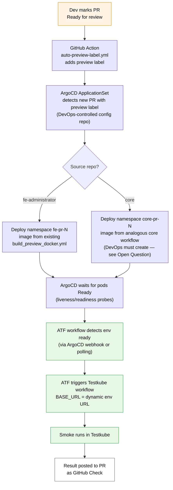
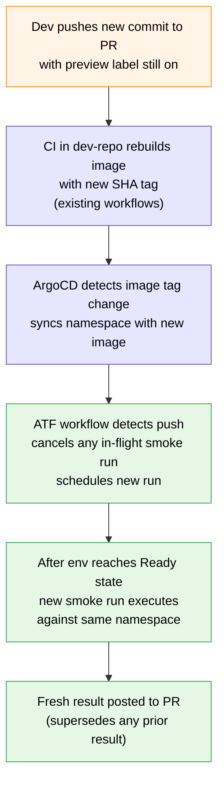
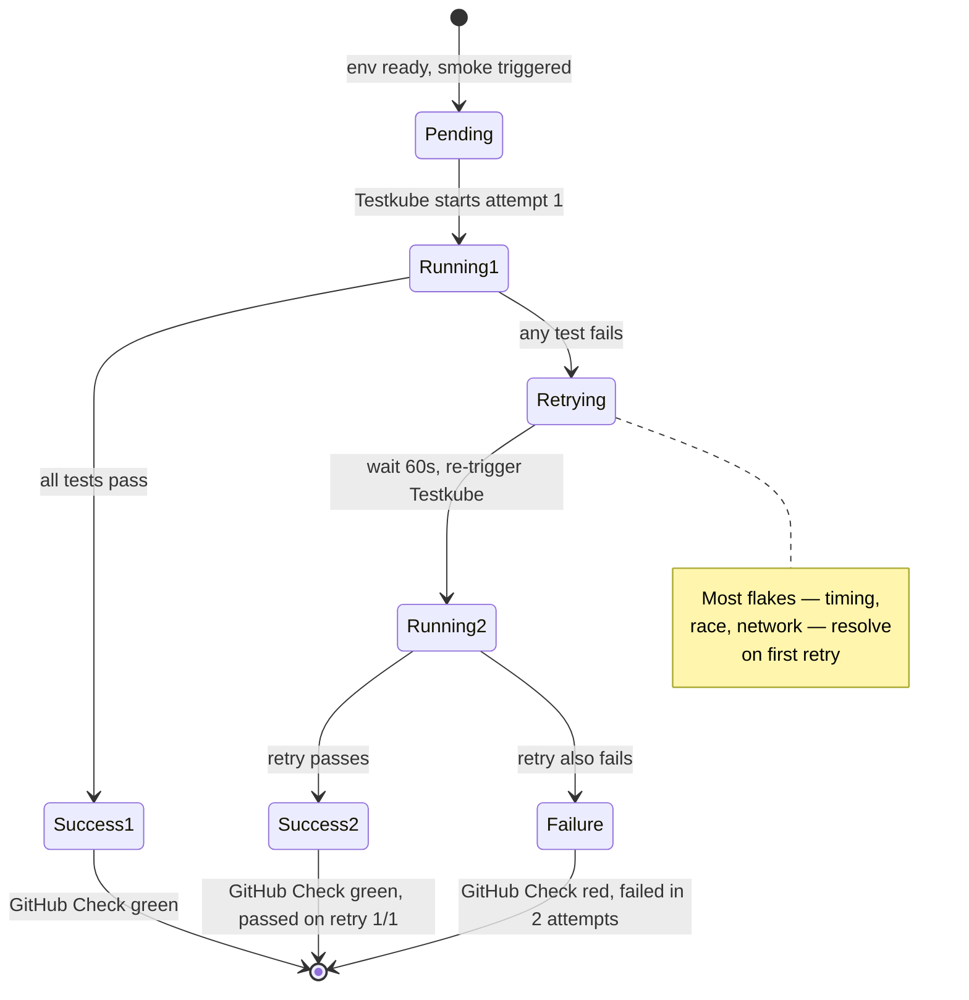

# PR Smoke Gate — Detailed Design

**Status:** Draft for review
**Author:** Ekaterina Rudenko (Lead QA, OmniTrust)
**Date:** 2026-05-16 (last revised 2026-05-18)
**Parent spec:** `2026-05-16-qa-infrastructure-overview.md`
**Scope:** Detailed design of the per-PR ephemeral preview environment + smoke gate. This is the Layer 4 PR check defined in the overview's Test Pyramid Positioning.

---

## 1. Executive Summary

When a developer pushes a pull request to `OmniTrustILM/fe-administrator` or `OmniTrustILM/core` and marks it Ready for review, an ephemeral environment is spun up on cluster `<preview-cluster>`, the smoke suite runs against it, and the result is posted to the PR as a **required** GitHub Check. If the check is red, merge is blocked — unless a `bypass-smoke` label is applied (with audit).

This catches integration regressions before they reach manual QA, while keeping dev feedback time under ~10 minutes for the happy path.

---

## 2. Goals & Non-Goals

### Goals

- Provide automated full-stack smoke test execution on every PR in `fe-administrator` and `core`
- Block merge when smoke is red — required check from day one
- Keep dev feedback latency low (target p95 < 10 minutes)
- Isolate flakiness impact: auto-retry once before declaring red
- Provide an explicit, audited bypass mechanism for legitimate emergencies
- Avoid resource exhaustion: hard cap on simultaneous preview environments

### Non-Goals

- **NOT a regression suite.** This is 6-10 tests of critical user flows. See `regression-suite.md` (future) for broader coverage.
- **NOT a substitute for dev-repo CI.** Layer 2-3 checks (build, unit, lint, SAST, SCA) stay in `core` and `fe-administrator` workflows.
- **NOT cross-browser exhaustive on PR.** Chromium only on PR (industry-standard fast-feedback pattern). Full matrix (Chromium + Firefox + WebKit) runs in daily smoke on QA env — separate workstream.
- **NOT a performance check.**
- **NOT covering cross-repo coordinated PRs in v1.** If a `core` PR requires a companion `fe-administrator` PR, both go through smoke independently. Cross-repo linking is v2 work.

---

## 3. Trigger Model

### 3.1 Initial trigger — auto-add `preview` label on Ready-for-review

A new GitHub Action in each PR-source repo listens to `pull_request.ready_for_review` and adds the `preview` label automatically.

```yaml
# .github/workflows/auto-preview-label.yml
# Added to fe-administrator AND core repos
name: Auto-add preview label
on:
  pull_request:
    types: [ready_for_review]
jobs:
  add-label:
    if: github.event.pull_request.draft == false
    runs-on: ubuntu-latest
    permissions:
      pull-requests: write
    steps:
      - name: Add preview label
        run: gh pr edit ${{ github.event.pull_request.number }} --add-label preview
        env:
          GH_TOKEN: ${{ secrets.GITHUB_TOKEN }}
          GH_REPO: ${{ github.repository }}
```

### 3.2 Why Ready-for-review (not PR-open)

- Draft PRs are exploratory — developers iterate rapidly; spinning up an env on every draft push wastes the preview cluster resources
- Marking "Ready for review" is the natural developer signal "this is worth verifying"
- Required-check semantics align: a draft PR cannot be merged anyway, so a required check on it would be noise

### 3.3 Manual control overrides

- **Dev wants smoke on a draft:** Manually add `preview` label to the draft. Env spins up, smoke runs.
- **Dev wants to skip smoke for a doc-only PR:** Manually remove `preview` label after it's added. Env never created. (But required-check semantics block merge until the check is set — see Section 7.4 for handling.)
- **Dev wants to free up cluster capacity:** Manually remove `preview` label. Env destroyed. Smoke re-runnable by re-adding label.

### 3.4 Removal triggers

The `preview` label is auto-removed in three cases:

1. **PR converted to draft** (`pull_request.converted_to_draft` event) — env torn down because the work is no longer "ready"
2. **PR closed or merged** (`pull_request.closed` event) — env torn down because the work is complete or abandoned
3. **24h inactivity on an open PR** — TTL safety net; see Section 4.4

In all three cases, removing the `preview` label triggers ArgoCD to **prune and delete** the namespace (and all resources inside it — pods, services, ingress, persistent volumes) within minutes. **PR close/merge is independent of the 24h TTL** — the env is destroyed essentially immediately on close, not after 24h. The TTL is only a safeguard for PRs that remain open with the label but receive no activity.

> **How ArgoCD detects "no longer needed":** ArgoCD ApplicationSet generates one Application per PR with `preview` label. When the label disappears (or PR closes), ApplicationSet evaluates "this PR no longer matches" and deletes the corresponding Application. Application deletion cascades to all Kubernetes resources it created — namespace, pods, services, ingress, PVCs. Cleanup takes a few minutes due to graceful pod shutdown (e.g., core flushes pending DB transactions before exiting).

**Why the label is explicitly removed on close/merge:** Without this step, a `preview` label would remain on the closed PR record (since labels persist in GitHub's PR metadata). Someone reviewing a closed PR could misread "still has `preview` label" as "env is still alive." Auto-removing the label keeps label state synchronised with env state — if you see a PR without `preview` label, you can trust there is no env for it.

Manual label removal by the developer does NOT close the PR — it only frees cluster resources. The dev can re-add the label later to recreate the env.

---

## 4. Environment Lifecycle

### 4.1 Creation flow



### 4.2 Update on push



**Why cancel old run on push:** Old run's result reflects old code. Showing it would confuse reviewers. Concurrency: GitHub Actions `concurrency.group` on PR number + `cancel-in-progress: true`.

### 4.3 Teardown triggers

| Trigger | Action | Timing |
|---|---|---|
| `preview` label removed manually | Namespace destroyed (ArgoCD prunes Application) | Within minutes |
| PR converted to draft | `preview` label auto-removed by workflow → namespace destroyed | Within minutes |
| **PR closed or merged** | **`preview` label auto-removed by workflow → namespace destroyed** | **Within minutes (NOT 24h)** |
| 24h since last activity on **open** PR (push / comment / label change / smoke run) | TTL safety-net job removes `preview` label → namespace destroyed; PR comment posted: "Preview env destroyed due to 24h inactivity. Re-add `preview` label to recreate." | At next TTL cron tick (hourly) after 24h elapses |

### 4.4 TTL specifics

A scheduled GitHub Action runs hourly in ATF repo. It enumerates all PRs with `preview` label across `fe-administrator` and `core`. For each:
- Computes `last_activity_at` = max(last push, last comment, last label change, last smoke run timestamp)
- If `now - last_activity_at > 24h` → removes `preview` label → posts PR comment with notification

This is a safeguard against forgotten labels. Normal flow does not depend on TTL.

---

## 5. Smoke Test Execution

### 5.1 Test runner architecture

- **Test code:** lives in `OmniTrustILM/automated-testing-framework` (ATF) repo, `czertainly-e2e/tests/smoke/`
- **Test executor:** Testkube agent on `<preview-cluster>` cluster (in `testkube` namespace, deployed by DevOps)
- **Trigger:** GitHub Actions workflow in ATF repo, invoked via `repository_dispatch` from dev-repo on env-ready signal

### 5.2 Browser strategy

Per overview Section 6.1: **Chromium only on PR** for fast feedback. Daily smoke on QA env runs the full matrix.

`playwright.config.ts` already supports multiple projects. PR smoke invokes only the `chromium` project:

```bash
npx playwright test --project=chromium
```

### 5.3 Retry behaviour



- Smoke runs once
- If it fails, ATF workflow automatically re-triggers Testkube once (after a 60s wait)
- If retry passes → GitHub Check green, annotation "passed on retry 1/1"
- If retry fails → GitHub Check red, annotation "failed (2 attempts)"

Rationale: most flakes (timing, race conditions, transient network) resolve on retry. Distinguishing infrastructure vs test failures is deferred (see Section 9).

### 5.4 Cancel-in-progress on new push

GitHub Actions workflow uses:
```yaml
concurrency:
  group: smoke-${{ github.event.pull_request.number }}
  cancel-in-progress: true
```

Old smoke run is cancelled when new commit arrives.

---

## 6. Implementation — Workflow Files

This section lists the exact workflow files to add and what they do. Files in ATF are committed via this spec's implementation PR; files in `fe-administrator` / `core` require separate PRs in those repos.

### 6.1 In ATF repo (`OmniTrustILM/automated-testing-framework`)

**New workflow:** `.github/workflows/pr-smoke-gate.yml`

- **Trigger:** `repository_dispatch` event type `pr-smoke-requested`
- **Payload:** `{ pr_number, repo, head_sha, env_url, browser=chromium }`
- **Steps:**
  1. Checkout ATF
  2. Set GitHub Check status `pending` on the PR commit (in source repo, via GH API with PAT)
  3. Trigger Testkube workflow with `baseUrl` config parameter
  4. Wait for Testkube completion (poll Testkube API)
  5. On pass → set GitHub Check `success`
  6. On fail → trigger second Testkube run (retry)
  7. On retry pass → set Check `success` with annotation
  8. On retry fail → set Check `failure` with link to Testkube run
  9. On bypass label detected at any point → set Check `success` with annotation "Bypassed by @<user>" + post audit comment

**New workflow:** `.github/workflows/ttl-cleanup.yml`

- **Trigger:** `schedule` cron hourly
- **Steps:** As described in Section 4.4

### 6.2 In `fe-administrator` repo

**New workflow:** `.github/workflows/auto-preview-label.yml`

- As shown in Section 3.1

**New workflow:** `.github/workflows/trigger-smoke.yml`

- **Trigger:** webhook from ArgoCD when namespace becomes Ready (or `pull_request.synchronize` after image build completes — implementation detail to coordinate with DevOps)
- **Steps:**
  1. Build env URL from PR number (e.g., `https://fe-pr-${PR_NUMBER}.<preview-domain>`)
  2. Send `repository_dispatch` event to ATF with payload
  3. (GitHub Check is set by ATF workflow, not here)

**New workflow:** `.github/workflows/draft-cleanup.yml`

- **Trigger:** `pull_request.converted_to_draft`
- **Steps:** Remove `preview` label (idempotent — succeeds even if label absent)

**New workflow:** `.github/workflows/pr-close-cleanup.yml`

- **Trigger:** `pull_request.closed` (fires on both close and merge)
- **Steps:** Remove `preview` label (idempotent)
- **Why:** Keeps `preview` label state synchronised with env state on PR close/merge — see Section 3.4 for rationale.
- Minimal implementation:
  ```yaml
  name: PR close cleanup
  on:
    pull_request:
      types: [closed]
  jobs:
    remove-label:
      runs-on: ubuntu-latest
      permissions:
        pull-requests: write
      steps:
        - run: gh pr edit ${{ github.event.pull_request.number }} --remove-label preview || true
          env:
            GH_TOKEN: ${{ secrets.GITHUB_TOKEN }}
            GH_REPO: ${{ github.repository }}
  ```

### 6.3 In `core` repo

Same four workflows as `fe-administrator` (Section 6.2): `auto-preview-label.yml`, `trigger-smoke.yml`, `draft-cleanup.yml`, `pr-close-cleanup.yml`. URL convention is `core-pr-${PR_NUMBER}.<preview-domain>`. **Prerequisite:** core must first have its analogue of `build_preview_docker.yml` working (Open Question in overview).

### 6.4 DevOps deliverables (NOT in ATF / dev repos)

- **ArgoCD ApplicationSet:** updated to recognise `preview` label on both `fe-administrator` and `core` PRs; provision namespaces accordingly with full ILM stack
- **Ingress / DNS:** `*.<preview-domain>` wildcard pointing to the preview cluster ingress; per-namespace ingress rules
- **TLS:** wildcard cert for `*.<preview-domain>`
- **Webhook from ArgoCD:** notifies dev-repo workflow when namespace is Ready
- **Resource quotas:** per-namespace limits to prevent any single preview from starving the preview cluster

---

## 7. Result Reporting

### 7.1 GitHub Check states

| State | When |
|---|---|
| `pending` | Env spinning up, or smoke running |
| `success` | Smoke passed (annotated whether on first run or retry) |
| `failure` | Smoke failed after retry |
| `success` (with annotation "Bypassed by @user") | `bypass-smoke` label applied |

### 7.2 PR check details — what dev sees

The check on the PR includes:
- Status (pending/success/failure)
- Link to Testkube run (for full logs / video / screenshots)
- Summary: "X of Y tests passed, Z failed" + browser
- For failures: link to first failed test screenshot

### 7.3 Bypass mechanism

When `bypass-smoke` label is added:

1. ATF workflow detects label on next poll
2. Posts PR comment:
   > ⚠️ **Smoke check bypassed** by @<username> at <timestamp>
   >
   > Please reply with the reason for bypass. This bypass is logged for the weekly audit report.
3. Sets GitHub Check `success` with annotation
4. Adds entry to `audit/bypass-log.jsonl` (in ATF repo, append-only, committed by bot)

**Audit review:** QA Lead reviews `audit/bypass-log.jsonl` weekly. If bypass count > 5/week, investigate root cause (flake, infra, gate misuse).

### 7.4 Edge case — manual removal of `preview` label

If a dev removes the `preview` label intending to skip smoke, the required GitHub Check is never set → PR is blocked from merging.

**Resolution paths:**
- Dev adds label back → env spins up → smoke runs → check set
- Dev adds `bypass-smoke` label → bypass mechanism kicks in → check set as bypassed

Documentation in PR template / dev onboarding guide will clarify this.

---

## 8. Concurrency Model

### 8.1 Cap

Maximum **10 simultaneous preview environments** on the preview cluster across both repos. Configurable via repo variable `PREVIEW_ENV_CAP`.

### 8.2 Behaviour at cap

When an 11th `preview` label add is detected:
1. ATF workflow checks current preview count via ArgoCD API / Kubernetes API
2. If at cap → post PR comment:
   > ⏸️ **Smoke queued** — cluster at capacity (10/10). Smoke will start when a slot frees up.
3. Workflow polls every 5 minutes until a slot opens or 2-hour timeout
4. On slot available → proceed normally
5. On 2-hour timeout → set Check `failure` with annotation "Cluster capacity exhausted. Free up slot or use `bypass-smoke`."

### 8.3 Why 10

Initial estimate based on the preview cluster sizing (1 ILM stack ≈ ~10 GB RAM). DevOps confirmation pending (overview Section 12 Open Question).

### 8.4 Reserved slot for RC env

Once RC env (v2) deploys on the preview cluster, total slots = 10 preview + 1 RC. RC has higher priority class so it cannot be evicted by preview load.

---

## 9. Failure Modes

### 9.1 What "smoke failed" can mean

| Category | Cause | Who's responsible | v1 handling |
|---|---|---|---|
| 🔴 **PR fail** | Real regression in PR code | Dev | Fix code, push, smoke re-runs |
| 🟡 **Infra fail** | ArgoCD didn't deploy, env never Ready, Testkube agent down | DevOps | Auto-retry once; if still failing, manual `bypass-smoke` |
| 🟠 **Flake** | Race condition, timing, network glitch | QA team to stabilise | Auto-retry once usually resolves |

### 9.2 v1 — uniform handling

All failure types take the same path: **auto-retry once, then mark red**. We do not attempt classification in v1.

Justification:
- Classification requires parsing Testkube exit codes and log patterns — complex, fragile
- One retry covers ~80% of flake cases (timing, network)
- Persistent infra issues are rare and bypassable

### 9.3 v2 evolution

After 1-2 months of flake-rate data, consider adding classification:
- Detect "env never reached Ready" → label as infra fail, retry up to 3x
- Detect specific test-level failures vs setup failures → different retry profile

---

## 10. Smoke Test Coverage & Data Strategy

### 10.1 Smoke Test Coverage (v1 scope)

OmniTrustILM v1 PR Smoke Gate covers **eight critical user flows**, in the 5-10 sweet-spot range per Section 5.4. Each test runs against the per-PR preview env (Chromium only on PR; full browser matrix on daily smoke).

| # | Test | What it verifies | Test data dependencies |
|---|---|---|---|
| 1 | **Login** (SMK-001 + extensions) | User authentication via Keycloak; admin login + additional role login flows | Admin user in Keycloak realm `ILM` (baseline) |
| 2 | **Navigation** (SMK-002) | Sidebar navigation opens each top-level page; main content area renders correctly | Admin user only |
| 3 | **Network discovery** (SMK-003) | Discovery wizard creates discovery; polls for completion; verifies discovered certificate details | Discovery Provider connector (baseline); test creates discovery inline, cleans up in `afterEach` |
| 4 | **Issue certificate** | Request issuance through RA Profile; verify certificate state, details, history, attributes | Authority connector (EJBCA) + CA cert uploaded + RA Profile linked (baseline); test creates issuance inline, cleans up |
| 5 | **Issue via ACME** | Issue certificate through ACME protocol against ACME Profile | EJBCA setup (as test 4) + ACME Profile linked (baseline); test runs ACME order inline |
| 6 | **Generate key** | Generate a cryptographic key through Token Profile; verify key state, details | Cryptographic Provider (SOFT) connector + Token Profile (baseline); test creates key inline, cleans up |
| 7 | **Upload + batch delete certificate** | Upload single certificate; batch upload N certs; verify batch delete removes all | No connector needed; test creates and deletes inline |
| 8 | **Custom attribute lifecycle** | Create custom attribute; assign to resource; verify assignment; remove attribute | No connector needed; test creates and deletes inline |

**Tests 4 and 5 depend on EJBCA infrastructure** — see Open Issues (Section 12) for the deployment-strategy decision (shared on `<preview-cluster>` vs per-env vs external). Until EJBCA strategy is decided with DevOps, these two tests cannot be implemented.

These tests are deliberately small in coverage but high in critical-path importance. They form the "is the build fundamentally broken" filter, NOT the "every feature works" filter (that role belongs to regression suite — Layer 5 in the overview).

### 10.2 Baseline (provided by Helm chart bootstrap)

When an ArgoCD ApplicationSet deploys a preview namespace, the Helm chart bootstraps the following — everything required for tests 1-8 above to find their pre-conditions:

- **Admin user** in Keycloak (creds match `ADMIN_USERNAME` / `ADMIN_PASSWORD` Kubernetes secret used by Testkube workflow)
- **Keycloak realm `ILM`** with client `ilm`
- **Connector deployments:**
  - Discovery Provider (existing in the permanent preview env today) — required by test 3
  - Authority — EJBCA (NEW for v1) — required by tests 4, 5
  - Cryptographic Provider — Software (SOFT) (NEW for v1) — required by test 6
- **CA certificate uploaded** into Certificate Inventory (NEW) — required by test 4
- **Default RA Profile** linked to EJBCA authority (NEW) — required by test 4
- **ACME Profile** linked to RA Profile (NEW) — required by test 5
- **Token Profile** linked to SOFT provider (NEW) — required by test 6
- **RabbitMQ topology** (existing) — exchange + queues per existing RabbitMQ setup documentation in this repo's `docs/` folder
- **Clean Postgres** (no user-generated data)

The the permanent preview env env currently provides only the first three items (admin user, Keycloak, Discovery Provider). Items marked NEW are net-new bootstrap requirements that the Helm chart must learn to provision. Owner: DevOps + QA collaborate on extending the chart.

### 10.3 Per-test ephemeral data

Smoke tests create their own ephemeral data inline and clean up:

- Test 1 (auth): no data creation, login only
- Test 2 (navigation): no data creation
- Test 3 (discovery): creates `smoke-discovery-${Date.now()}` discovery; `afterEach` deletes discoveries, certificates, keys
- Test 4 (issue cert): creates issuance request inline with unique CN per run; `afterEach` revokes/deletes
- Test 5 (ACME): runs ACME order with unique account/identifier; `afterEach` revokes/deletes
- Test 6 (generate key): creates key with unique name; `afterEach` deletes
- Test 7 (upload + batch delete): uploads and deletes inline (self-cleaning by design)
- Test 8 (custom attribute): creates attribute with unique name; `afterEach` removes

**Tests must be self-contained and self-cleanup.** This pattern protects against state leakage between runs and supports the optional "EJBCA shared on the preview cluster" deployment strategy (Open Question — Section 12).

### 10.4 Extensibility for future seeding

Some future tests (e.g., approval workflow tests that need pre-existing pending requests) may require richer fixture data. The architecture must allow adding seeding without changes to app code.

**Design principle:** Baseline (admin/realm/connectors) goes through Helm chart bootstrap. Optional test fixtures (sample certificates, RA profiles, approval policies) are added as a separate mechanism:

- ConfigMap with SQL or API-driven seeding scripts
- Post-sync ArgoCD hook job runs seeding before tests start
- Or Testkube setup workflow runs before smoke workflow
- QA team owns fixtures, devs don't touch

**v1:** Only baseline through Helm. Seeding mechanism is a documented plug-in point, not implemented yet.

---

## 11. Cross-Browser, Visual Regression, Accessibility Setup

### 11.1 Browser configuration in `playwright.config.ts`

The existing config defines projects. v1 ensures `chromium` works fully. Firefox + WebKit projects exist but are only used by daily smoke on QA env (separate workstream).

```ts
projects: [
  { name: 'chromium', use: { ...devices['Desktop Chrome'] } },
  { name: 'firefox', use: { ...devices['Desktop Firefox'] } },
  { name: 'webkit', use: { ...devices['Desktop Safari'] } },
]
```

PR smoke invokes: `npx playwright test --project=chromium`

### 11.2 Visual regression setup

Add to v1 smoke suite: `toHaveScreenshot()` assertions on 5-7 key pages:
- Login screen (post-fill, pre-submit)
- Dashboard (after login)
- Certificate list (table state)
- Discovery wizard (step 1)
- Settings page
- Connectors list
- (one TBD based on critical path priorities)

Baselines stored in `czertainly-e2e/tests/smoke/__screenshots__/`. Tolerance `maxDiffPixelRatio: 0.02`.

**Maintenance:** When intentional UI change lands, baselines must be regenerated:
```bash
npx playwright test --project=chromium --update-snapshots
```
Updated baselines reviewed in same PR as UI change.

### 11.3 Accessibility setup

Add dependency: `@axe-core/playwright`.

Helper fixture in `czertainly-e2e/fixtures/`:
```ts
export async function expectNoA11yViolations(page: Page) {
  const results = await new AxeBuilder({ page })
    .withTags(['wcag2a', 'wcag2aa', 'wcag21aa'])
    .analyze();
  const blocking = results.violations.filter(v => ['critical', 'serious'].includes(v.impact));
  expect(blocking).toEqual([]);
  // Log moderate/minor as warnings (not test failure)
}
```

Use in tests after navigating to major pages:
```ts
await page.goto('/dashboard');
await expectNoA11yViolations(page);
```

v1 fail threshold: critical + serious violations fail the test. Moderate / minor are logged for QA review but do not block.

---

## 12. Open Issues / Future Work

| Item | Track | When |
|---|---|---|
| **EJBCA deployment strategy** for preview envs (shared on `<preview-cluster>` vs per-env sub-chart vs external) | DevOps + QA Lead blocker | Before v1 launch for smoke tests 4-5; align with planned Digital Signing API tests setup |
| **Helm chart extension** to bootstrap full connector baseline (EJBCA, SOFT, RA Profile, ACME Profile, Token Profile, CA cert) | DevOps + QA blocker | Before v1 launch for smoke tests 4-6 |
| ArgoCD ApplicationSet for `core` PRs | DevOps blocker | Before v1 launch for `core` arm |
| Core per-PR image build workflow (analogue of `build_preview_docker.yml`) | DevOps blocker | Before v1 launch for `core` arm |
| `<preview-cluster>` capacity confirmation → final cap value | DevOps | Before v1 launch |
| Cross-repo PR linking (`fe-administrator` PR + `core` PR pair) | v2 spec | After v1 stable |
| Failure-mode classification (infra vs test vs flake) | v2 spec | After 1-2 months flake data |
| Multi-tier retry strategy | v2 spec | After v1 |
| RBAC on `bypass-smoke` label (only QA Lead / Tech Lead) | v2 spec | If bypass abuse observed |
| Required-check transition: when to enable branch protection enforcement | DevOps + QA Lead | After flake rate < 5% over 7 days |

---

## 13. Dependencies on DevOps

The following must be true before v1 launches:

1. ✅ `<preview-cluster>` Kubernetes cluster operational with Testkube agent deployed in `testkube` namespace
2. ⏳ ArgoCD ApplicationSet configured to recognise `preview` label on `fe-administrator` PRs and provision `fe-pr-<N>` namespaces with full ILM stack
3. ⏳ ArgoCD ApplicationSet **extended** to recognise `preview` label on `core` PRs and provision `core-pr-<N>` namespaces
4. ⏳ `core` repo has a per-PR Docker image build workflow analogous to `fe-administrator`'s `build_preview_docker.yml`
5. ⏳ Ingress + DNS for `*.<preview-domain>` wildcard pointing to the preview cluster
6. ⏳ Wildcard TLS cert for `*.<preview-domain>`
7. ⏳ Per-namespace resource quotas on `<preview-cluster>` to enforce cap and prevent runaway consumption
8. ⏳ ArgoCD → ATF / dev-repo notification mechanism when namespace becomes Ready (webhook or workflow_run-style trigger)

Items marked ⏳ are owned by DevOps and tracked in overview Section 11.

---

## 14. Revision History

| Date | Author | Change |
|---|---|---|
| 2026-05-16 | Ekaterina Rudenko | Initial draft via brainstorming session |
| 2026-05-18 | Ekaterina Rudenko | Aligned browser strategy with `fe-administrator` convention (Chromium-only on PR); incorporated factual state of Layer 2-3 (verified via repo inspection); clarified `core` Docker build prerequisite |
| 2026-05-18 | Ekaterina Rudenko | Added explicit `preview` label removal on PR close/merge via new `pr-close-cleanup.yml` workflow (keeps label state synced with env state); rewrote Section 3.4 to remove ambiguity about teardown timing (env destroyed on close, NOT after 24h); cross-referenced overview Section 4 QA Workflow & Touch Points |
| 2026-05-18 | Ekaterina Rudenko | Converted ASCII diagrams to Mermaid: Section 4.1 creation flow, Section 4.2 update-on-push flow, Section 5.3 retry state diagram. Renders natively in GitHub PR view and Docusaurus. |
| 2026-05-18 | Ekaterina Rudenko | Replaced "GC" jargon in Section 3.4 and 4.3 with explicit "ArgoCD prunes Application → deletes all resources"; added inline explanation of ArgoCD ApplicationSet behaviour for non-DevOps readers |
| 2026-05-18 | Ekaterina Rudenko | Renamed Section 10 to "Smoke Test Coverage & Data Strategy" with new 10.1 listing all 8 v1 smoke tests with data dependencies; expanded baseline (10.2) to include EJBCA, SOFT provider, RA/ACME/Token Profiles, CA cert upload; surfaced EJBCA deployment strategy as HIGH-priority Open Issue blocking tests 4-5 |
| 2026-05-18 | Ekaterina Rudenko | Adjusted preview env cap from 5 to 10 simultaneous ILM stacks (Section 8.1-8.4) |
