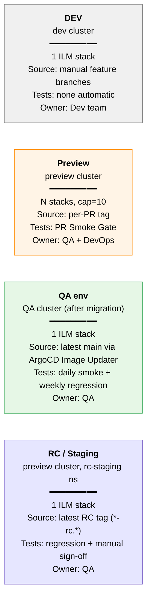
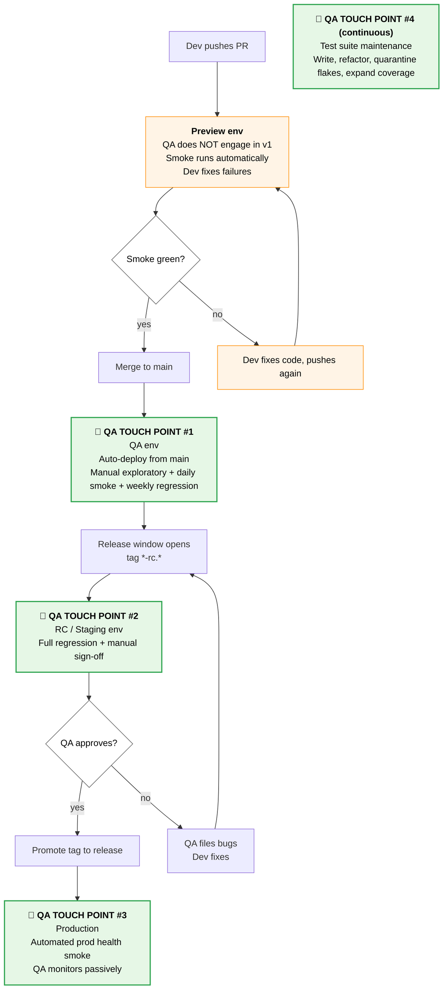
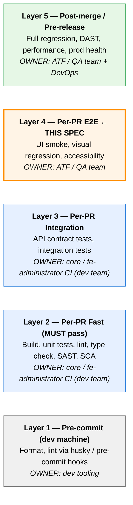

# QA Infrastructure — Overview

**Status:** Draft for review
**Author:** Ekaterina Rudenko (Lead QA, OmniTrust)
**Date:** 2026-05-16 (last revised 2026-05-18)
**Scope:** Top-level architecture and roadmap for QA infrastructure at OmniTrustILM. Detailed designs for individual workstreams live in dedicated sub-specs.

---

## 1. Executive Summary

OmniTrustILM currently has minimal QA automation infrastructure: 3 smoke tests running against a single permanent preview environment (the permanent preview env), with manual QA happening on a shared developer cluster (`<dev-cluster>`). This is unsustainable as the product grows.

This document defines a **four-tier environment architecture** plus a portfolio of test types (smoke, regression, performance, security, accessibility, crypto correctness, etc.), positioned along a multi-quarter roadmap. The first deliverable — **PR Smoke Gate** — is detailed in a companion sub-spec.

The intent is to give stakeholders (DevOps, dev leads, QA, management) a single artifact that:
- Describes the **target state** of QA infrastructure
- Defines **where each kind of test runs**
- Defines **when QA engages** in the development lifecycle
- Sequences work into **achievable phases**
- Surfaces **dependencies on DevOps** so they can be unblocked early

---

## 2. Goals & Non-Goals

### Goals

- Establish clear separation between **DEV / Preview / QA / RC** environments
- Provide **fast feedback** to developers (smoke gate on every PR)
- Enable **safe release process** (RC validation before production)
- Cover **all major test types** the product needs (functional, security, performance, accessibility, crypto correctness)
- Define **ownership and maintenance** policies so tests don't rot

### Non-Goals

- This document does NOT prescribe individual test cases
- This document does NOT replace test plans for specific features
- This document does NOT cover **unit / integration tests** (those live in `core` and `fe-administrator` CI and are owned by dev teams — see Section 5 Test Pyramid Positioning)
- This document does NOT cover **mobile testing** (admin UI is desktop-only)
- This document does NOT cover **internationalisation testing** (product is English-only)
- This document does NOT cover **chaos engineering** or **disaster recovery testing** (out of QA mandate)
- This document does NOT cover **production observability** (DevOps domain)

---

## 3. Architecture — Four-Tier Environment Model



### 3.1 DEV environment (`<dev-cluster>`)

- **Purpose:** Developer playground. Devs deploy feature branches manually to experiment.
- **Source:** Manual `helm install` / `helm upgrade` by devs (no automation).
- **Capacity:** 1 ILM stack.
- **Lifecycle:** Indefinite. No SLA. May be broken at any time.
- **Tests run here:** None automatically. Devs may run ad-hoc.
- **Owner:** Dev team.
- **Change:** Status quo. Document the role officially.

### 3.2 Preview environments (`<preview-cluster>`)

- **Purpose:** Ephemeral per-PR environments for automated smoke testing.
- **Source:** PR's image tag, deployed via ArgoCD ApplicationSet on `preview` label.
- **Capacity:** Up to 10 simultaneous ILM stacks (`fe-pr-N`, `core-pr-N` namespaces). Cap is configurable; reflects current `<preview-cluster>` sizing assumption.
- **Lifecycle:**
  - Created when `preview` label is added to PR (label auto-added when PR transitions to "Ready for review")
  - Destroyed when label is removed, PR is closed, or 24h of inactivity elapses
- **Tests run here:** PR Smoke Gate (Chromium), visual regression baseline, accessibility checks.
- **Owner:** QA writes tests; DevOps owns cluster.
- **Detail:** See `2026-05-16-pr-smoke-gate-design.md`.

### 3.3 QA environment (`<qa-cluster>`, after migration)

- **Purpose:** Single canonical instance running latest `main`. Where manual QA happens. Where daily smoke and weekly regression run.
- **Source:** ArgoCD Image Updater pulls latest `main` image on every merge.
- **Capacity:** 1 ILM stack.
- **Lifecycle:** Permanent. Updated automatically on every merge to `main`.
- **Access URL:** `<qa-env-domain>` (DNS alias to be configured).
- **Tests run here:**
  - Daily smoke (cron 03:00 UTC) — replaces current the permanent preview env daily run. **Full browser matrix** (Chromium + Firefox + WebKit)
  - Weekly regression suite
- **Owner:** QA.
- **Prerequisite:** Migration of Testkube agent + permanent preview from `<qa-cluster>` to `<preview-cluster>`. After migration, `<qa-cluster>` is freed for QA env role.

### 3.4 RC / Staging environment (`<preview-cluster>`, namespace `rc-staging`)

- **Purpose:** Pre-release validation. QA runs full regression suite here, manually signs off before production tag is cut.
- **Source:** Latest RC tag (e.g., `2.18.0-rc.1`), deployed via ArgoCD on tag push.
- **Capacity:** 1 ILM stack (long-lived namespace alongside preview envs).
- **Lifecycle:** Permanent namespace, content rotates with each release cycle.
- **Tests run here:** Full regression suite + manual sign-off.
- **Owner:** QA owns content; DevOps owns cluster.
- **Trade-off accepted:** Shares failure domain with preview envs on `<preview-cluster>`. Mitigation: resource quotas + priority classes (RC gets higher priority than preview).

---

## 4. QA Workflow & Touch Points

A common question when reading this document: **"where does QA actually engage?"** — especially since preview environments are explicitly defined as developer-facing. This section maps the four QA touch points across the development lifecycle.



### 4.1 QA Philosophy — "QA-after-merge" vs "QA-before-merge"

OmniTrustILM follows the industry-standard **QA-after-merge** philosophy in v1. This is the convention in modern SaaS development with small QA teams.

| QA philosophy | Where QA approves | Suits team size | Risk |
|---|---|---|---|
| **QA-after-merge** (CHOSEN for v1) | Post-merge on QA env + pre-release on RC | 1-3 QA | Bugs may briefly land in main; caught downstream |
| **QA-before-merge** (gated) | Pre-merge on preview env | 5+ QA | QA becomes velocity bottleneck if understaffed |

**Why "QA-after-merge" is right for OmniTrustILM v1:**
- Current QA team size: 1 Lead QA (SDET hire in progress)
- Reviewing every PR pre-merge would still consume ~1+ hour/day on procedural checks (currently up to 5 PRs/day) AND create a bottleneck where one busy QA blocks all merges across both repos — costly without commensurate benefit given the strong automated layers below
- Strong automated layers (PR Smoke Gate + future regression) substitute for manual gating
- Bugs that escape smoke are caught on QA env (within hours of merge) or on RC env (before release)

### 4.2 Daily QA time allocation under "QA-after-merge"

| Activity | Where | Frequency | Time estimate |
|---|---|---|---|
| **Test suite automation** (write new tests, refactor, quarantine flakes, maintain framework) | ATF repo | Continuous | **~70% of time** — dominant activity, driven by the v1-v3 roadmap volume |
| Exploratory testing of recently merged changes | QA env | Daily | ~1 hour/day |
| Review automated regression results, file bugs | QA env | Weekly | 1-2 hours/week (when automation matures) |
| Full regression for RC sign-off | RC env | Per release | 1-2 concentrated days (shifts priorities during the release window) |
| Optional: spot-check risky PR before merge | Preview env | Ad-hoc | By exception only |

The 70% automation allocation reflects roadmap reality: v1 alone requires 5 new smoke tests + a11y + visual baselines + Helm chart bootstrap collaboration; v2-v3 add 20-30 regression tests + crypto correctness + API tests + performance + DAST + prod health smoke. This is months of focused engineering work for one QA Lead (and eventually one new SDET).

The "optional spot-check" leverages the same preview env: a QA engineer can voluntarily visit the per-PR preview URL (`<repo>-pr-<N>.<preview-domain>`) if they want to verify a particular change. **No formal process** — just optional inspection. The PR Smoke Gate workflow is not blocked on it.

### 4.3 Future enhancement (v2): `qa-review-needed` label

If the v1 "QA-after-merge" philosophy proves to under-protect against certain classes of bugs (e.g., complex multi-step user flows that smoke can't fully cover), an opt-in mechanism may be added:

- Tech Lead / QA can apply `qa-review-needed` label to a PR
- Preview env becomes long-lived (no TTL cleanup) until QA explicitly approves
- A second required check (`qa-approved`) blocks merge until QA gives sign-off
- Used only for "risky" PRs identified at code-review time

This is **NOT in v1 scope** — to be revisited after 1-2 months of operating "QA-after-merge" and seeing what's actually missed.

---

## 5. Test Pyramid Positioning

The QA Infrastructure described in this document occupies a **specific layer** of the broader testing pyramid. Recognising where our boundary lies prevents both **gaps in coverage** (assuming "the smoke gate caught everything") and **redundant work** (duplicating tests that already run in developer repos' CI).



(Mermaid does not render an actual pyramid shape; the layered stack here preserves the hierarchical relationship.)

### 5.1 Why this matters

A PR Smoke Gate test failing because of a bug that should have been caught by a unit test is **a process failure**, not a smoke failure. Conversely, a unit test passing is not evidence that a critical user flow works end-to-end — that's what Layer 4 verifies.

The layers must work together:
- **Layer 2-3** catch most bugs cheaply (unit, integration, SAST, SCA) in dev-repo CI
- **Layer 4** (this spec) catches integration failures across the full stack (FE + core + DB + auth)
- **Layer 5** catches release-blocking issues (regression, performance, security)

### 5.2 Current state of Layer 2-3 (as of 2026-05-18)

Verified by inspecting workflow files in both repos.

**`core` repo** (`OmniTrustILM/core`, Java/Maven):

| Check | Workflow | Verdict |
|---|---|---|
| Build (`mvn clean package`) | `build_pr.yml` | ✅ |
| Unit tests (Maven Surefire) | implicit in `mvn package` | ✅ |
| Code coverage (Jacoco) | `build_pr.yml` (uploaded as artifact) | ✅ |
| SAST: CodeQL | `codeql.yml` | ✅ |
| SAST: SonarQube | `sonar.yaml` | ✅ |
| Docker image testing | `test_docker_image.yaml` | ✅ |
| SCA (dependency updates) | Renovate (visible via update branches) | ✅ |
| **Integration tests** | not visibly separated | ❓ — Open Question (see Section 12) |

**`fe-administrator` repo** (`OmniTrustILM/fe-administrator`, Node/TypeScript):

| Check | Workflow | Verdict |
|---|---|---|
| Build + Lint (`npm run lint && npm run build`) | `build_pr.yml` | ✅ |
| TypeScript type-check | implicit in TS build | ✅ |
| Unit tests (Vitest) | `vitest.yml` | ✅ |
| Component tests (Playwright CT) | `playwright.yml` | ✅ |
| SAST: CodeQL | `codeql.yml` | ✅ |
| SAST: SonarQube | `sonar.yml`, `sonar-main.yml`, `dispatch-sonar.yml` | ✅ |
| Preview Docker image build per-PR | `prepare_preview.yml`, `dispatch-preview-docker.yml`, `build_preview_docker.yml` | ✅ |
| SCA | Renovate | ✅ |

**Conclusion:** Both repos have solid Layer 2-3 coverage. The PR Smoke Gate (Layer 4) fits cleanly on top — no duplication, no gap. The only Open Question is `core` integration tests (see Section 12).

### 5.3 What Smoke Gate is NOT

The Layer 4 PR Smoke Gate is **NOT**:
- A substitute for unit / integration tests (those stay in dev repos)
- A full regression — that's Layer 5 (post-merge, on QA env)
- A performance gate — that's Layer 5
- A security scan — SAST/SCA are Layer 2, DAST is Layer 5
- A QA review step — see Section 4 QA Workflow & Touch Points

The Smoke Gate is **specifically**: a small (5-10 tests) UI E2E suite running against a full ephemeral stack, ensuring critical user flows work end-to-end.

### 5.4 Smoke suite sizing — industry guidance

| Size | Runtime | Verdict |
|---|---|---|
| 1-3 tests | < 3 min | Too thin — fails to catch meaningful regressions |
| **5-10 tests** | **5-10 min** | **Sweet spot for PR feedback** |
| 10-15 tests | 10-15 min | Upper bound of comfortable size |
| 20+ tests | 15+ min | This is not smoke — it's mini-regression |

OmniTrustILM v1 target: **6-8 tests** (3 current + 3-5 critical). In the sweet spot.

---

## 6. Test Matrix — What Runs Where, When

| Test type | Environment | Trigger | Coverage (v1) | Coverage (target) | Browser axis | Detailed sub-spec |
|---|---|---|---|---|---|---|
| **PR Smoke Gate** | Preview | PR ready-for-review + each push | 8 tests: login, navigation, discovery, cert issuance (regular + ACME), key generation, cert upload/batch-delete, custom attributes — see PR Smoke Gate spec Section 10.1 | 10-15 tests | Chromium only | `pr-smoke-gate-design.md` ✅ |
| **Daily smoke** | QA env | Cron 03:00 UTC | Same as PR smoke | Same as PR smoke | Chromium + Firefox + WebKit | `daily-smoke-migration.md` (future) |
| **Visual regression** | Preview (PR) + QA env (daily) | Same as PR smoke | Baseline screenshots of 5-7 key pages | Full UI surface | Chromium only | (folded into PR Smoke Gate sub-spec) |
| **Accessibility (a11y)** | Preview | Same as PR smoke | axe-core on smoke pages | All public pages | Chromium (axe-core is browser-agnostic) | `a11y-testing.md` (future) |
| **Regression suite** | QA env (weekly cron) + RC (per release) | Cron + manual trigger on RC tag | TBW: 20-30 critical paths | 50-100 tests | Chromium + Firefox | `regression-suite.md` (future) |
| **RC manual sign-off** | RC / Staging | RC tag deployed | Manual full regression | + Compliance scenarios | Chromium + Firefox | `rc-testing.md` (future) |
| **API testing (Digital Signing)** | Preview / Dedicated EJBCA env | Per-PR + scheduled | Digital Signing API contracts | Full API surface (TSP, signing, validation) | N/A (API) | `api-testing.md` (future) |
| **Crypto correctness** | Dedicated env (TBD) | Scheduled (nightly) | Key gen + sign/verify happy path | Chain validation, PQC algorithms, edge cases | N/A (CLI / API) | `crypto-correctness.md` (future) |
| **Performance / load** | Dedicated perf env (TBD) | Pre-release manual | k6/JMeter baseline scenarios | Load profile, soak tests, capacity tests | N/A | `performance-testing.md` (future) |
| **SAST / SCA** | dev-repo GitHub Actions runners | Per-PR | CodeQL + SonarQube + Renovate (already in place — see Section 5.2) | Same | N/A | (owned by dev teams) |
| **DAST** | QA env or dedicated | Scheduled (weekly) | Active scan profile | Full scan profile | Chromium (headless scanner) | `security-dynamic-scan.md` (future) |
| **Prod health smoke** | Production | Post-deploy webhook | Health endpoints + auth | Critical user flows | Chromium | `prod-health-smoke.md` (future) |

**Legend:**
- ✅ — Sub-spec written and approved
- (future) — High-level scope captured here; detailed sub-spec to be written as a separate design document

---

## 7. Cross-Cutting Test Strategy

### 7.1 Cross-browser coverage

OmniTrustILM follows the same convention already used by `fe-administrator`'s `playwright.yml` for component tests: **Chromium on PR, full browser matrix (Chromium / Firefox / WebKit) on scheduled main runs.** This prioritises fast PR feedback while still catching browser-specific regressions before release.

| Test type | On PR | On main (daily / scheduled) |
|---|---|---|
| PR Smoke Gate | Chromium only | N/A (daily smoke is the scheduled run) |
| Daily smoke | N/A | Chromium + Firefox + WebKit |
| Visual regression | Chromium only | Chromium only (Firefox/WebKit baselines differ) |
| Accessibility (a11y) | Chromium (axe-core is browser-agnostic) | Same |

Edge and Safari (beyond WebKit) coverage: deferred. Add when customer demand is documented.

### 7.2 Accessibility testing (a11y)

**Driver:** EU Accessibility Act effective 2025-06-28. EU customers will require WCAG 2.1 AA conformance documentation.

**Approach:**
- Integrate `@axe-core/playwright` into smoke runs
- Each smoke test that opens a major page checks for a11y violations (`expect(await new AxeBuilder({ page }).analyze()).toHaveNoViolations()`)
- v1: Critical and serious violations fail the smoke check; minor/moderate logged as warnings
- v2: Dedicated a11y suite covering ALL public pages, not just smoke-targeted ones

**Reporting:** Violations included in Playwright HTML report and Testkube run artifacts.

### 7.3 Visual regression

**Approach:** Built-in Playwright `toHaveScreenshot()` with stored baseline PNGs in repo.

- **v1:** Baseline screenshots for ~5-7 key pages (login, dashboard, certificate list, discovery wizard, settings).
- **Maintenance burden:** Baselines must be regenerated when intentional UI changes happen. Process: developer updates baseline in same PR as UI change, QA reviews.
- **Flake risk:** Subpixel rendering differences. Mitigated by `maxDiffPixelRatio: 0.02` tolerance.

### 7.4 Crypto correctness (THE differentiator for PKI products)

Smoke "click login" does NOT verify that this product, as a cryptographic system, **works correctly**. For a PKI/PQC product, this is the fundamental quality dimension.

**Approach (future spec):**
- Dedicated test suite separate from UI smoke
- Verifies: key generation across all supported algorithms (RSA, ECDSA, EdDSA, PQC); signing and verification round-trip; certificate chain validation; CRL/OCSP correctness; HSM integration sanity
- Runs nightly on dedicated env with realistic EJBCA setup
- Failure here is **blocker for release** (more critical than UI smoke)

**Why elevated priority:** A UI regression annoys users; a crypto bug invalidates trust in the product entirely.

---

## 8. Implementation Roadmap

```
v1 (NOW → 2-3 months)           v2 (3-6 months)              v3 (6-12 months)
─────────────────────           ────────────────              ─────────────────
✓ PR Smoke Gate                 RC env setup                 Performance testing
  (FE + core repos)             Regression suite (20-30)      (k6 baseline)
✓ Browser strategy:             Daily smoke migration         DAST scheduled scans
  Chromium on PR,               Crypto correctness (initial)  Prod health smoke
  full matrix on daily          API testing setup             Quarantine dashboard
✓ a11y baseline                 Test metrics dashboard
✓ Visual regression baseline    DORA metrics tracking
✓ Test ownership matrix         `qa-review-needed` opt-in
✓ Quarantine policy             (if needed after v1 data)

✓ = covered in v1 sub-specs (PR Smoke Gate detailed; others described high-level here)
```

### v1 Milestones

| # | Milestone | Owner | Blocker / Dependency |
|---|---|---|---|
| 1 | DevOps confirms `<preview-cluster>` capacity and cap value | DevOps | Hardware purchased |
| 2 | DevOps creates ArgoCD ApplicationSet for `core` PRs | DevOps | (Currently only `fe-administrator` has one; verified) |
| 3 | DevOps confirms image-build machinery for `core` per-PR (analogous to `fe-administrator`'s `build_preview_docker.yml`) | DevOps | Required for core PR previews |
| 4 | QA writes 3-5 additional critical smoke tests | QA Lead | None |
| 5 | QA implements PR Smoke Gate workflows in ATF + `fe-administrator` + `core` | QA Lead | (1), (2), and (3) |
| 6 | QA integrates `@axe-core/playwright` into smoke fixture | QA Lead | None |
| 7 | QA writes baseline visual regression snapshots | QA Lead | None |
| 8 | DevOps configures branch protection: required check on `main` in both repos | DevOps | After smoke flake rate stabilises |

### v2 Milestones

| # | Milestone | Owner |
|---|---|---|
| 9 | RC env namespace on `<preview-cluster>`, ArgoCD wired to RC tags | DevOps |
| 10 | Daily smoke retargeted to QA env (full browser matrix) | QA Lead |
| 11 | First 20 regression tests written | QA Lead |
| 12 | Crypto correctness initial suite (key gen + sign/verify) | QA Lead / new SDET hire |
| 13 | Test metrics dashboard (Grafana sourcing from Testkube) | QA Lead + DevOps |
| 14 | `qa-review-needed` opt-in mechanism (if v1 experience proves need) | QA Lead |

---

## 9. Test Ownership Matrix

| Test type | Primary owner | Secondary | Maintenance frequency |
|---|---|---|---|
| Smoke (PR + daily) | QA Lead | New SDET hire | Per-feature when smoke breaks |
| Regression | QA Lead | New SDET hire | Quarterly review for coverage gaps |
| Visual regression | QA Lead | All QA team | When UI changes |
| Accessibility | QA Lead | None initially | Per-release |
| Crypto correctness | New SDET hire (preferred) | QA Lead | Per-release; +0 for new algorithms |
| Performance | TBD (new hire) | DevOps | Per-release |
| SAST / SCA | DevOps | QA Lead reviews findings | Continuous (tool-driven) |
| DAST | DevOps + QA | Both review findings | Weekly scan, monthly review |
| Prod health smoke | QA Lead | DevOps | After each release |

**Open hire:** This depends on the SDET hire (in flight per project memory). Until then, QA Lead is sole owner of everything.

---

## 10. Test Maintenance & Quarantine Policy

### 10.1 Quarantine

A test is a candidate for quarantine when:
- It fails ≥3 times in a rolling 7-day window **without a code change explaining the failure**
- It has known intermittent behaviour (race condition, timing-dependent) that cannot be fixed within current sprint

**Quarantine process:**
1. Author / QA Lead adds `@quarantine` annotation to the test
2. Test is excluded from required smoke check (no longer blocks merge)
3. Test continues running in regression for visibility
4. JIRA / GitHub Issue created to track flake root cause
5. Test re-enabled when fix lands and flake rate is < 1% over 7 days

### 10.2 Deprecation

A test is a candidate for removal when:
- Feature it covers is removed from the product
- It is fully redundant with another test (overlap > 80%)
- It has been quarantined for > 30 days without progress

**Deprecation process:**
1. Author / QA Lead proposes removal in PR
2. QA Lead reviews
3. Removal merged with explanation in commit message

### 10.3 Update guidance

When a test starts failing due to legitimate UI/API change:
- Update test in **same PR** as the change (not in a follow-up)
- Visual regression baselines: regenerate via `playwright test --update-snapshots`, verify diff manually before committing

---

## 11. Metrics & Dashboards

### 11.1 What we want to know

| Metric | Why | Source | Target |
|---|---|---|---|
| Smoke pass rate (rolling 7 days) | Health of smoke suite | Testkube + custom collector | > 95% |
| Smoke flake rate (% of runs that pass on retry) | Indicator of test stability | Testkube + custom collector | < 5% |
| Smoke duration p50 / p95 | Dev feedback latency | Testkube | p95 < 10 min |
| Time-to-merge (PR created → merged) | Effect of gate on dev velocity | GitHub API | Baseline established in v1 |
| Bypass label usage (count / week) | Trust signal — high usage = gate not trusted | GitHub API | < 5/week |
| Test count per type | Coverage growth | Repo grep | Trending up |
| MTTR for smoke failures | How fast devs fix breakages | GitHub API | < 1 working day |

### 11.2 Dashboards

- **v1:** Testkube native UI for individual runs. Manual weekly summary by QA Lead.
- **v2:** Grafana dashboard sourcing from Testkube API + GitHub API. Auto-refresh, viewable by all stakeholders.

---

## 12. Open Questions / Dependencies

| Question | Owner | Blocking | Priority |
|---|---|---|---|
| What is `<preview-cluster>` actual capacity in simultaneous ILM stacks? | DevOps | Sets cap value for preview envs | HIGH (before v1 launch) |
| Why did the second ILM instance fail to come up on `<qa-cluster>`? | DevOps | Future cluster scaling decisions | MEDIUM |
| ArgoCD ApplicationSet for `core` PRs — currently only `fe-administrator` has it | DevOps | Blocks v1 multi-repo gate | HIGH |
| Image build machinery for `core` per-PR (analogue of `fe-administrator`'s `build_preview_docker.yml`) | DevOps | Blocks v1 core-side gate | HIGH |
| **EJBCA deployment strategy for preview envs** — shared instance on `<preview-cluster>` vs per-env sub-chart vs external server. Blocks smoke tests 4 (issue certificate) and 5 (issue via ACME). Should align with planned Digital Signing API tests setup. | DevOps + QA Lead | Blocks v1 smoke tests 4-5; tests 1-3 and 6-8 can proceed without | HIGH |
| Helm chart extension: bootstrap must include Authority connector (EJBCA), Cryptographic Provider (SOFT), RA Profile, ACME Profile, Token Profile, CA cert upload. Currently the permanent preview env provides only Discovery Provider. | DevOps + QA Lead | Blocks v1 smoke tests 4, 5, 6 | HIGH |
| Does QA focus only on `main` trunk, or also `main-saas`? | Dev Lead + QA Lead | Defines QA env source | HIGH |
| `core` integration tests — do they exist beyond Maven Surefire? Or are integration paths covered only by Layer 4 smoke? | Dev Lead | Affects what failures Smoke Gate is expected to catch | MEDIUM |
| RC tag convention (`X.Y.Z-rc.N`?) | Dev Lead | Blocks v2 RC env wiring | MEDIUM |
| Cross-repo PR linking (FE PR + core PR pair) — workflow | QA Lead + Dev Lead | Out of v1 scope; document for v2 | LOW |
| Dev env (`<dev-cluster>`) future — keep, refresh, or replace? | DevOps + Dev Lead | Not blocking; clarify ownership | LOW |

---

## 13. Glossary

| Term | Definition |
|---|---|
| ATF | Automated Testing Framework — the repo `OmniTrustILM/automated-testing-framework` |
| Cap (preview cap) | Maximum number of simultaneous preview environments on `<preview-cluster>`. Initially 10. |
| ILM | Identity Lifecycle Management — the full product stack (core + FE + dependencies) |
| Preview env | Ephemeral environment created per PR for automated smoke. Lives in `<preview-cluster>`. |
| QA env | Single canonical instance running latest `main`. Lives in `<qa-cluster>` after migration. |
| RC env | Long-lived environment for release candidate testing. Lives in `<preview-cluster>` namespace `rc-staging`. |
| Smoke gate | Required GitHub Check enforcing smoke tests pass before PR merge |
| Bypass | Mechanism for merging a PR without green smoke check (label `bypass-smoke` + audit) |
| Testkube agent | Long-running Kubernetes component executing test workflows. Single instance on `<preview-cluster>`. |
| Layer 2-3 | Build, unit tests, lint, type check, SAST, SCA, integration tests — runs in dev-repo CI |
| Layer 4 | UI E2E smoke, visual regression, accessibility — runs in ATF (this spec) |
| Layer 5 | Full regression, DAST, performance, prod health — post-merge / pre-release |
| QA-after-merge | Workflow philosophy: QA engages on QA env (post-merge) and RC env (pre-release), NOT on every PR. Suits 1-3 QA teams. |
| QA-before-merge | Workflow philosophy: QA approves every PR before merge. Suits 5+ QA teams. |
| QA Touch Point | A defined moment in the dev/release lifecycle where QA actively engages. Four points defined: QA env (ongoing), RC env (per release), Production (post-deploy monitoring), Test maintenance (continuous). |

---

## 14. Sub-Specs Index

This overview is intentionally high-level. Detailed designs live in dedicated sub-specs:

| Sub-spec | Status | File |
|---|---|---|
| PR Smoke Gate | ✅ Draft for review | `2026-05-16-pr-smoke-gate-design.md` |
| Daily smoke migration | Planned | (future session) |
| Regression suite design | Planned | (future session) |
| RC / Staging env | Planned | (future session) |
| API testing (Digital Signing) | Planned | (future session) |
| Performance testing | Planned | (future session) |
| Crypto correctness | Planned | (future session) |
| Security testing (DAST) | Planned | (future session) |
| Accessibility testing (full coverage beyond smoke) | Planned | (future session) |
| Production health smoke | Planned | (future session) |
| `qa-review-needed` opt-in mechanism | Possible v2 | (revisit after v1 data) |

---

## 15. Revision History

| Date | Author | Change |
|---|---|---|
| 2026-05-16 | Ekaterina Rudenko | Initial draft via brainstorming session |
| 2026-05-18 | Ekaterina Rudenko | Added Section 5 Test Pyramid Positioning with factual Layer 2-3 audit; revised browser strategy to match `fe-administrator` convention (Chromium on PR, full matrix daily); added Open Questions for `core` integration tests and image-build machinery |
| 2026-05-18 | Ekaterina Rudenko | Added Section 4 QA Workflow & Touch Points with explicit QA-after-merge philosophy; documented daily QA time allocation; mentioned future `qa-review-needed` opt-in for v2 |
| 2026-05-18 | Ekaterina Rudenko | Converted ASCII diagrams to Mermaid: Section 3 four-tier env model, Section 4 QA touch points lifecycle, Section 5 test pyramid layers. Renders natively in GitHub PR view and Docusaurus. |
| 2026-05-18 | Ekaterina Rudenko | Expanded PR Smoke Gate row in Test Matrix to list all 8 v1 smoke tests; added EJBCA deployment strategy and Helm chart extension as HIGH-priority Open Questions blocking smoke tests 4-6 |
| 2026-05-18 | Ekaterina Rudenko | Adjusted preview env cap from 5 to 10 simultaneous ILM stacks (Section 3.2, Section 13 glossary, Mermaid diagram) |
| 2026-05-18 | Ekaterina Rudenko | Updated PR volume assumption in Section 4.1 from 10-20 PRs/day to up to 5 PRs/day to match observed throughput; reframed QA-before-merge cost argument around bottleneck risk rather than time consumption |
| 2026-05-18 | Ekaterina Rudenko | Adjusted QA daily time allocation (Section 4.2): automation work raised from ~30% to ~70% to reflect actual scope of v1-v3 roadmap; reordered table with automation first; compressed exploratory testing from 3-4 hours to ~1 hour/day to fit |
